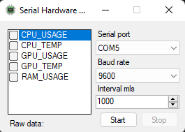
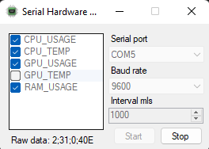

# SerialHardwareMonitor
Sends information about PC devices to the serial port Using Open Hardware Monitor library.

Winforms C# application.

Created using [Open Hardware Monitor](https://github.com/openhardwaremonitor/openhardwaremonitor)

